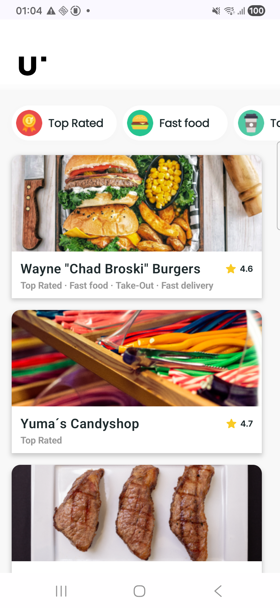
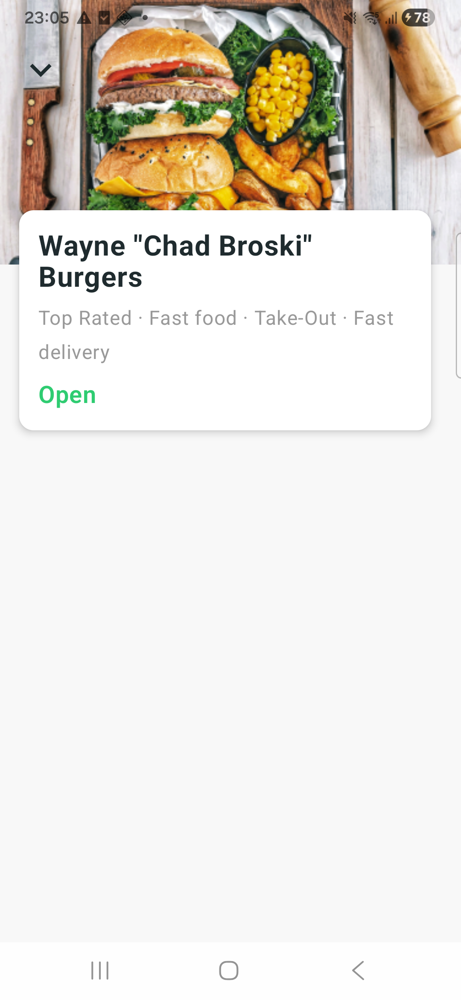

# ✦ MUNCHIES - RESTAURANT FINDER APP

Built with Jetpack Compose and 
modern Android architecture. 

*Part of the Umain Mobile internship Test*

---

# ✦ Screenshots

 
 
---

# ✦ Project Objective

Build a mobile application for Restaurant Delivery, allowing users to:

- Browse restaurants (fetched from a live REST API)
- Filter restaurants by category using horizontal filter chips
- View restaurant details including open/closed status in real time

---

# ✦ Tech Stack

| Technology | Purpose |
|---|---|
| **Kotlin** | Primary language |
| **Jetpack Compose** | Declarative UI framework |
| **Retrofit 2** | HTTP client for REST API calls |
| **Kotlinx Serialization** | JSON parsing |
| **OkHttp Logging Interceptor** | Network request debugging |
| **Coil** | Async image loading from URLs |
| **Navigation Compose** | Screen navigation (list → detail) |
| **Koin** | Dependency injection |
| **ViewModel + StateFlow** | UI state management |
| **Kotlin Coroutines** | Asynchronous programming |
| **Material3** | UI components and theming |
| **Android Studio** | IDE for development, emulator and debugging |
| **Samsung Galaxy A34 (SM-A346B)** | Physical device used for testing and UI validation |
| **Claude.ai** | Used as an AI learning assistant throughout development, for understanding concepts, debugging errors and exploring Android best practices |

---

# ✦ Architecture

The project follows **MVVM (Model-View-ViewModel)** architecture with a clean separation of concerns, wired together with **Koin** for dependency injection:

```
app/
├── RestaurantFinderApp.kt      # Application class, starts Koin
├── di/
│   └── AppModule.kt            # Koin module: provides the repository and view models
├── data/
│   ├── Models.kt                # Data classes (Restaurant, Filter, OpenStatus)
│   ├── RestaurantApi.kt         # Retrofit API interface
│   ├── NetworkModule.kt         # Sets up the API and JSON converter
│   └── RestaurantRepository.kt  # Fetches data from the API and caches it in memory
└── ui/
    ├── list/
    │   ├── RestaurantListScreen.kt    # List UI + Filter chips
    │   └── RestaurantListViewModel.kt # List state management
    └── detail/
        ├── RestaurantDetailScreen.kt    # Detail UI
        └── RestaurantDetailViewModel.kt # Loads the restaurant and its open/closed status
```

View models declare `RestaurantRepository` as a required constructor dependency and let Koin supply it. 
This keeps the view models easy to test and keeps object creation in one place (`AppModule.kt`) rather than spread across composables.

---

# ✦ Features

- **Restaurant List** = Displays all restaurants fetched from the API with image, name, tags, delivery time and rating
- **Horizontal Filter Chips** = Filter icons and names fetched from the API . Multiple filters can be selected simultaneously
- **Real-time Open/Closed Status** = Each restaurant's status is fetched live when opening the detail screen
- **Detail Screen** = Full-screen banner image, restaurant name, category tags and open/closed status
- **Error Handling** = Error states with user messages
- **Loading States** = Visual feedback while data is being fetched (spinner material3)

---

# ✦ API

Base URL: `https://food-delivery.umain.io/api/v1/`

| Endpoint | Description |
|---|---|
| `GET /restaurants` | Fetch all restaurants |
| `GET /filter/{id}` | Fetch filter details (name, icon) |
| `GET /open/{id}` | Fetch open/closed status for a restaurant |

---

# ✦ Design

The UI is based on a **Figma design** provided by Umain, implementing:

- Custom color palette
- Cards following Figma specs with Material3 elevation and dynamic height **adapted for content**
- Custom fonts: **Inter** (rating) and **Poppins** (filter chips)
- Gradient header separator
- Umain logo rendered as a Vector Drawable

---

# ✦ How to Run
### Prerequisites

- Android Studio **Hedgehog** or later
- JDK 11+
- Android SDK **API 37**
- Internet connection (app fetches live data)

### Steps

```bash
# 1. Clone the repository
git clone https://github.com/PatriciaGea/restaurant-finder-android.git

# 2. Open in Android Studio
# File → Open → select the cloned folder

# 3. Let Gradle sync finish automatically

# 4. Run on emulator or physical device
# Press the ▶️ Run button or Shift + F10
```

>  **Minimum SDK:** API 24 (Android 7.0)
>  **Target SDK:** API 36

---

# ✦ Concepts Practiced

- **Jetpack Compose** declarative UI with `LazyColumn`, `LazyRow`, and `Box` layouts
- **StateFlow** for reactive UI state, the screen automatically redraws when data changes
- **Coroutines** with `viewModelScope` for safe async operations tied to the UI lifecycle
- **Parallel API calls** using `async`/`awaitAll` to fetch multiple filters simultaneously
- **Navigation Compose** passing a restaurant id as a route argument, with the detail screen resolving the rest of the data itself
- **Dependency Injection with Koin**, providing the repository and view models through a single module
- **MVVM pattern** with clean separation between data, business logic and UI layers
- **Retrofit + Kotlinx Serialization** for type-safe API consumption
- **Coil** for efficient image loading and caching from remote URLs
- **Material3 components** (`Card`, `CardDefaults`) for professional elevation and shadows
- **Vector Drawables** for scalable logo rendering at any screen density

---

# ✦ Challenges & Learnings

### Parallel Filter Fetching
The API returns `filterIds` inside each restaurant, but filter details (name, icon) require separate calls. The solution was to collect all unique filter IDs across all restaurants and fetch them **in parallel** using Kotlin's `async`/`awaitAll`, reducing load time significantly compared to sequential calls.

### Navigation
The detail screen only needs a restaurant id to know what to show, so that's the only thing the route carries — keeping the navigation argument simple and avoiding the need to encode or decode complex objects. `RestaurantRepository` keeps the last fetched restaurants and filters in memory, so the detail screen's view model can look the restaurant up by id and only hits the network for the open/closed status, which does need to be fresh.

### Dependency Injection with Koin
The dependency graph (repository, view models) is declared once in `AppModule.kt` and provided by Koin, which is started from the `Application` class. Screens simply ask for a view model via `koinViewModel()`. Centralizing object creation this way keeps the dependency graph explicit and makes it straightforward to substitute fakes in tests.

### Dependency Compatibility
The project uses `compileSdk = 37` to satisfy `androidx.core:core-ktx:1.19.0` requirements, while keeping `targetSdk = 36` for runtime behavior stability. The Retrofit Kotlinx Serialization converter uses the official `com.squareup.retrofit2:converter-kotlinx-serialization`.

---
# ✦ Author

### Patrícia Gea Rodrigues • Android Developer

#### https://patriciageadev.vercel.app/  Portfolio
#### https://www.linkedin.com/in/patriciageadev/ Linkedin
#### patricia.gea@gmail.com

---


####  🔗 Check it out! more of my mobile projects :

#### https://github.com/PatriciaGea/business-card-patriciagea Business Card
#### https://github.com/PatriciaGea/plant-app-kotlin App Finder
#### https://github.com/PatriciaGea/app-android Random Messages

Thank You
